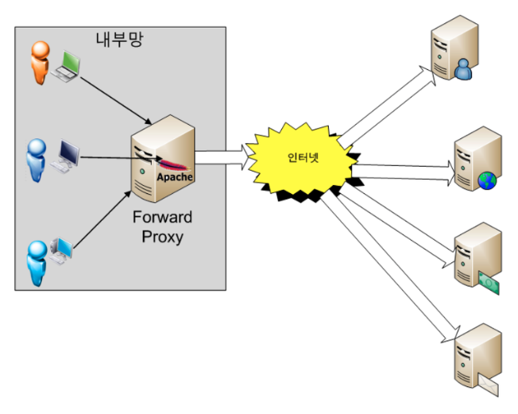
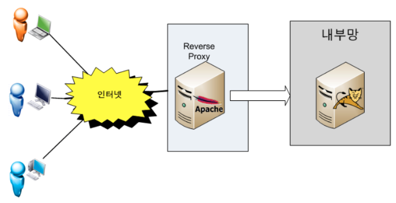
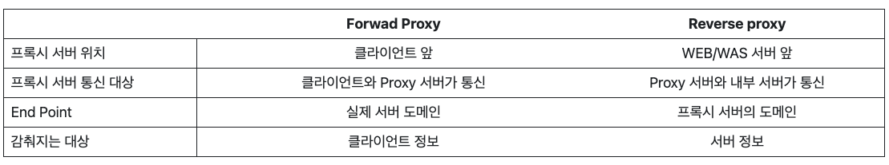

# Chapter 3. Web Server & Web Application Server(WAS), Reverse Proxy

# 1. Web Server
> 웹서버는 정적 콘텐츠(HTML, image, CSS, JavaScript 등)를 client에게 전달하는 역할을 수행한다. client가 웹 페이지나 파일을 요청하면, 웹 서버는 해당 파일을 찾아 response한다.
> ex: Apache, Nginx 등..

# 2. Web Application Server
> WAS는 동적 콘텐츠를 생성하고 실행하기위한 서버로 DB와 상호작용하고, 비즈니스 로직을 처리하며, 동적인 웹 페이지를 생성하는데 사용된다.

# 3. Proxy Server
> server와 client 사이에서 대리로 통신을 수행하는 기능을 하는 서버
## 주요 특징
- 호스트와 인터넷 사이를 중계하기 때문에 외부 인터넷에서 client의 정보를 알 수 없다.
- 외부 인터넷의 내부 침입을 막는 방화벽과 관련이 있다.
- Cache 기능이 존재한다. -> 속도향상
- IP를 바꾸기 위한 용도로 많이 사용된다.

# 3.1. Forward Proxy Server

> 클라이언트가 인터넷에 직접 접근하는게 아니라 Forward Proxy가 요청을 받고 인터넷에 연결하여 서버 응답을 클라이언트에게 전달(Forward)해준다.
> 우리가 흔히 아는 프록시 서버를 말한다!

## Forward Proxy Server 사용시 이점
- 클라이언트 보안(Security)
  - 보통 정부기관, 학교, 기업 등과 같은 곳에서는 속한 사람들의 제한적인 인터넷 사용을 위해 방화벽을 사용한다.
  - 포워드 프록시 서버에 룰을 추가하여 특정 사이트에 접속하는 것을 막는다.
  - 즉, 포워드 프록시 서버를 방화벽과 같은 개념으로 제한을 위해 사용한다고 보면 된다.
- 캐싱(Caching)
  - 클라이언트가 어떤 웹 페이지를 접근하면 포워드 프록시 서버는 해당 페이지의 정보를 캐싱(임시보관)한다.
  - 이후 동일한 페이지를 접근하거나, 다른 클라이언트가 해당 페이지를 요청하면 캐시 된 정보를 그대로 반환한다.
  - 이는 서버의 부하를 줄이는 데에 효과적이다.
- 암호화(Encryption)
  - 클라이언트 요청은 포워드 프록시 서버를 통과할 때 암호화된다.
  - 암호화된 요청은 다른 서버를 통과할 때 필요한 최소한의 정보만 갖게 되는데, 이는 클라이언트의 IP를 감춰주는 보안 효과를 낸다.

# 3.2. Reverse Proxy Server

> 클라이언트가 인터넷에 데이터를 요청하면 리버스 프록시 서버가 해당 요청을 받아 내부 서버에서 데이터를 받은 후 클라이언트에게 응답한다.
> 즉, 웹 서비스에 접근할 때 웹 서버에 요청하는 것이 아닌, 프록시 서버로 요청하게 되고, 프록시 서버가 배후서버(Reverse Server)로 부터 데이터를 가져오는 방식이다.
#### 간단 정리 : 클라이언트쪽으로 데이터(Response)를 밀어주는게 Forward, 그 반대편인 서버쪽으로 데이터(Request)를 밀어주는 것이 리버스(Reverse)라고 보면 좋다.

> 내부 서버에 직접적으로 접근 가능하게되면 DB에 접근이 가능하기 때문에 중간에 리버스 프록시를 두고 클라이언트와 내부 서버 사이의 다이렉트 통신을 막는 것이다.
#### Summary : 
- 우리가 일반적으로 구성하는 Web(Apache, Nginx)  <=====> WAS(Tomcat) 분리 형태를 리버스 프록시 형태라고 보면 된다.
- 여기서 Web(Apache, Nginx)이 Reverse Proxy가 되는 것이다.
- 하지만 만약 web(Apache, Nginx)이 WAS와 한 서버에 존재한다면 Reverse Proxy라는 개념이 없다.

## Reverse Proxy Server 사용시 이점
- 로드 밸런싱 (Load Balancing)
  - 우리가 자주 사용하는 구글, 네이버와 같은 웹 사이트는 하루에도 수백만, 수천만명이 방문한다.
  - 이러한 대량의 트래픽을 하나의 싱글 서버로 감당하기는 어렵다.
  - 이때, 리버스 프록시 서버를 여러개의 싱글 서버들 앞에 두면 특정 서버가 과부화 되지 않도록 로드 밸런싱하여 관리가 가능하다.
- 서버 보안(Security)
  - 리버스 프록시를 사용하면 서버측 보안에 좋다.
  - 프록시 서버로 인해 본래 서버의 IP 주소를 노출시키지 않을 수 있어, 해커들의 DDos 공격과 같은 공격을 막는데 용이하다.
- 캐싱(Caching)
  - 포워드 프록시의 캐싱과 비슷한 기능을 한다.
  - 즉, 서버의 데이터를 캐싱하고 있다가 동일한 요청인 경우 해당 데이터를 전달하여 빠른 성능을 보여준다.
- 암호화(Encryption)
  - SSL 암호화에 좋다.
  - 서버가 클라이언트와 통신할 때 SSL(or TSL)로 암호화, 복호화를 할 경우 각각의 서버별로 비용이 많이 들게 된다.
  - 리버스 프록시 서버를 사용하면 들어오는 요청과 복호화하는 응답을 모두 관리가 가능하여 서버의 부담을 줄여준다.

### 표 정리

