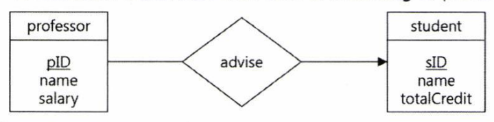
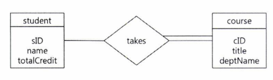

# **Chapter 4. DATABASE 설계 & AWS RDS 설정**
4주차 워크북 - Database, AWS RDS

<br>

# **외래키**
외부 키, foreign key

서로 다른 두 테이블을 연관지을 때 사용한다.
<br>
<br>

**FK의 특징**
1. FK는 참조되는 테이블의 PK만 참조한다.
2. FK를 생성하기 전에 PK를 먼저 생성해야 한다.

**FK 정의하는 코드**

```sql
Create table deptName(
    deptName    varchar(20) primary key,
    building    varchar(20)
)

Create table course(
    cID         char(5) primary key,
    title       varchar(20),
    deptName    varchar(20),
    credit      integer,
    foreign key (deptName) references department);
```

<br>
<br>    

# **기본키**
기본 키, primary key

테이블 내 모든 레코드를 각각 식별할 수 있는 고유 번호이다.
<br>
<br>


# **후보키**
후보 키, candidate key


<br>
<br>

# **수퍼키**
수퍼키, super key

후보키 중 
<br>
<br>


**PK의 특징**
1. 테이블 내에서 PK는 중복될 수 없다.
2. PK는 NULL값이 될 수 없다.
3. 모든 테이블에 PK가 존재할 필요는 없다.


<br>
<br>

# **ER 다이어그램**
ERD: Entity Relation Diagram
데이터와 그들 간의 관계를 사람이 이해할 수 있는 형태로 표현(모델링)하는 도구이다. ER 다이어그램의 표기법은 매우 다양하기 때문에 동일한 다이어그램도 다른 모습으로 표현할 수 있다.

사각형은 개체(도메인) 집합, 마름모는 관계성 집합, 밑줄은 PK 속성을 의미한다.


<br>
<br>

# **복합키**
테이블은 다수 개의 attribute를 PK로 가질 수 있다.
```sql
-- e.g.) takes 테이블: 학생이 수강하는 강의 정보
Create table takes(
    sID         char(5),
    cID         char(5),
    semester    char(6),
    year        numeric(4, 0),
    grade       char(2)),
    constraint takes_PK primary key(sID, cID, semester, year);
```
takes 테이블은 sID, cID, semester, year 4개의 attribute를 PK로 가진다. 이것은 'sID+cID+semester+year'인 하나의 문자열을 PK로 여긴다고 봐도 좋다. 만약 takes 테이블에

``` 
// pk만 모아보기
sID     cID     semester    year
1       30      spring      2022
1       30      winter      2022
```
첫 번째 행은 1번 학생이 강의번호 30번을 2022년 봄학기에 수강했다는 의미이고, 두 번째 행은 1번 학생이 강의번호 30번을 2022년 겨울학기에 수강했다는 의미이다. 위와 같은 두 행이 있을 때, 이 둘은 sID, cID, year가 같더라도 semester가 다르기 때문에 완전히 다른 행이다.
<br>
<br>

# **연관관계**
- 1:1 일대일

각 국가에는 수도가 하나이고 각 수도는 한 국가에만 속한다. 국가-수도의 관계처럼 정확히 일대일 매칭되는 관계가 1:1 관계이다.

- N:1 다대일 (Many-to-one)

보통 교수 한 명은 학생 여러 명을 상담하고, 학생 한 명은 교수님 한 명에게만 상담을 받는다. 이러한 관계성을 N:1 (student가 N) 관계라고 한다.



- N:M 다대다 (Many-to-many)

학생 한 명은 여러 개의 과목을 수강하고, 하나의 과목에는 여러 명의 학생이 수업을 수강한다. 이러한 관계성을 N:M 관계라고 한다.




<br>
<br>

# **정규화**
제1정규형, 제2정규형, 제3정규형, BCNF, 제4정규형, 제5정규형이 있다.

- 제1정규형 (1NF)

관계형 데이터모델은 속성 값으로 원자값(atomic value)만 허용한다. 즉, 도메인의 모든 값이 원자값이어야 한다.

원자값이란 더 이상 논리적으로 분해할 수 없는 값이며, 다중값을 가질 수 없음을 의미한다. 
원자값이 아닌 값으로 집합, 리스트 등이 있다.

- 제2정규형 (2NF)


<br>
<br>

# **반 정규화**

<br>
<br>