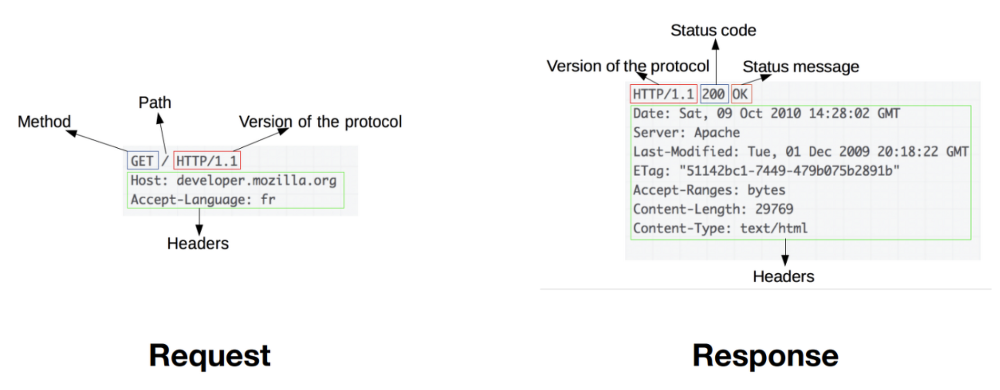
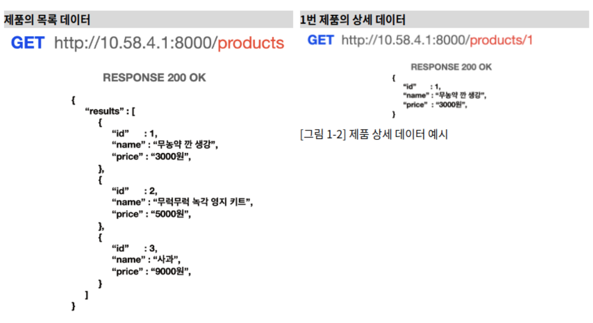
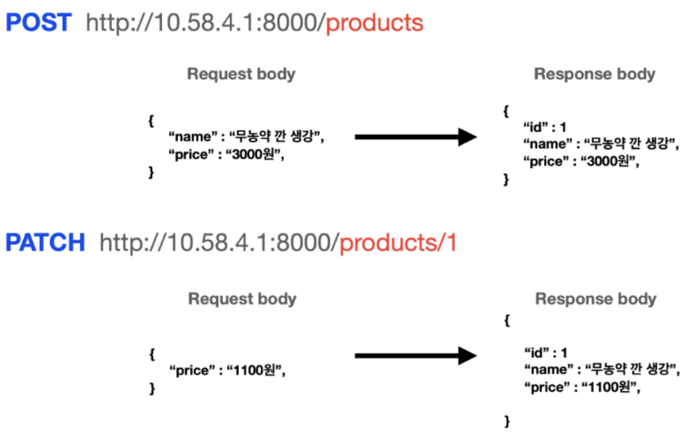
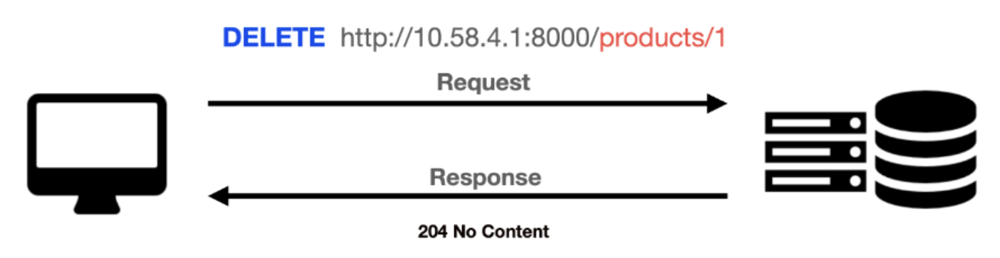
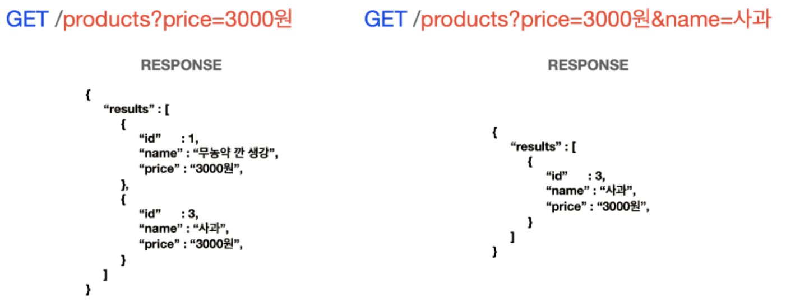
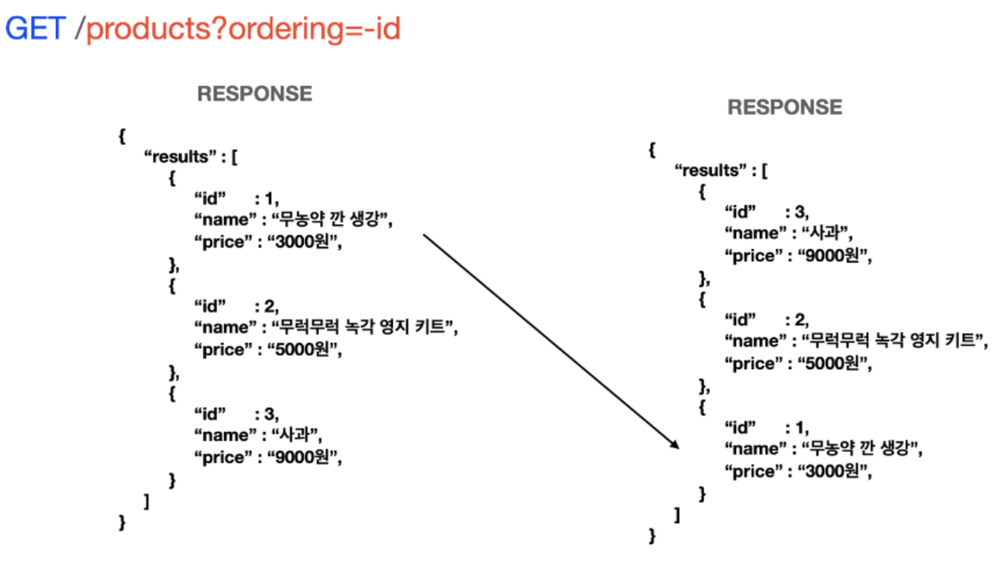
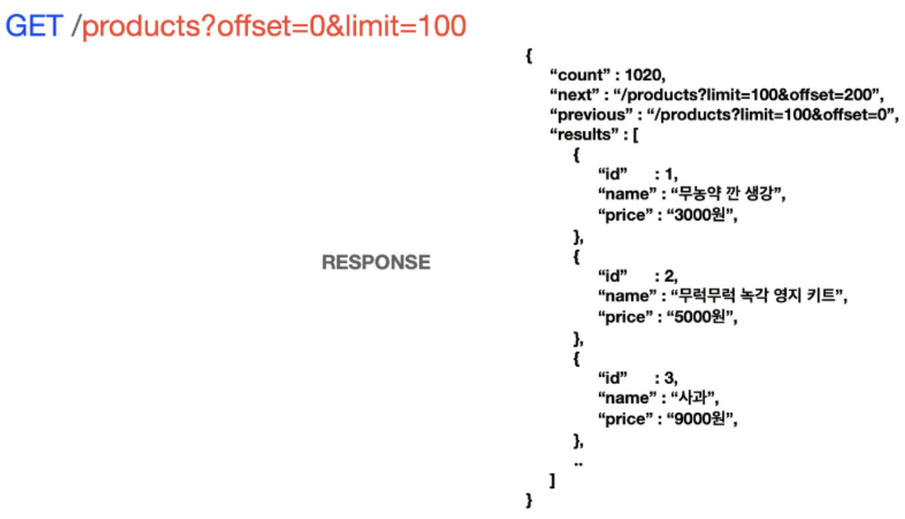
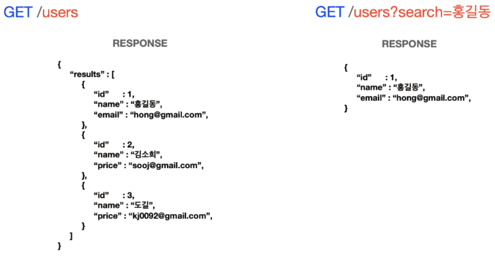

# Chapter 6. API URL의 설계 & 프로젝트 세팅

# 1. Request & Response
> Request는 클라이언트 -> 서버 
> > POST, PUT 요청과 같이 전달되는 데이터로 전달되는 데이터가 없을 경우 Body가 없을 수도 있음

> Response는 서버 -> 클라이언트

--- 

### 1.1 Header
> Header는 메타데이터를 담고 있으며, 형식을 결정

- Request Header
  - Request Method : GET, POST, PUT, DELETE, PATCH..
  - Request URL : 요청 URL
  - Host : 요청한 서버의 도메인명 혹은 IP주소
  - User-Agent : 클라이언트의 브라우저 정보
  - Accept : 클라이언트가 받아들일 수 있는 MIME 타입
    - > MIME 타입 : 문서, 파일 또는 바이트 집합의 성격과 형식
  - Content-Type : 요청 Body의 MIME 타입
  - Authorization : 인증 토큰 정보 등..

- Response Header
  - Status Code : 응답 상태 코드 (200, 404, 500..)
  - Content-Type : 응답 Body의 MIME 타입
  - Content-Length : 응답 Body의 길이
  - Set-Cookie : 쿠키 정보 등...

### 1.2 Body
- Request Body
  - 실제로 서버로 전달되는 데이터를 담고 있음
  - 서비스 플로우에 맞게 적절히 설정해야함

- Response Body
  - 서버가 클라이언트에게 응답할 데이터가 존재할 경우 담고 있음

# 2. Path Variable vs Query String

> /users?id=123 # 아이디가 123인 사용자를 가져온다.

> /users/123 # 아이디가 123인 사용자를 가져온다. 

##### 둘의 공통점 : 유동적인 값을 전달하기 위해 URL로 넘겨진다.
##### 그렇다면 둘의 차이점은 무엇인가?

### 2.1. 명칭부터 확실히 해보자! 
- path variable
- path parameter
- parameter
- URL parameter
---
- query string
- query parameter
- query
- URL query

### 2.2 각각 언제 사용해야 되는가?
- path variable
  - 고유한 자원을 지칭할 때 
  - 구체적인 리소스를 식별할 때

- query string
  - 정렬 or 필터링된 리소스를 가져올 때
    - 데이터 필터링
    - 데이터 정렬
    - 데이터 수 조절(페이지네이션)
    - 검색 등
  - 특정한 조건을 주고싶을 때

### 2.2.1 path variable

- https://map.naver.com/v5/entry/place/{placeId}
<- 변수를 지정한 형태. 백엔드 서버 입장에서는 매개변수 이지만, 클라이언트가 API를 호출할 때는 해당 매개변수를 아래와 같이 실제 값으로 대체하여 호출.
  - https://map.naver.com/v5/entry/place/11583199
  - https://map.naver.com/v5/entry/place/1353885407
  - https://map.naver.com/v5/entry/place/12017005

- 이렇듯 고유한 자원을 지칭할 때 유용
- 변수로 지정함으로써 유일한 값을 식별하는 역할을 수행하도록 함

#### GET, POST, PATCH, DELETE 예시

- 제품의 목록 데이터 : products라는 리소스에 접근, 제품의 전체 목록을 나타냄 
- 제품의 상세 데이터 : products/1이라는 리소스에 접근, 1번 제품에 대한 정보만을 나타냄

- POST의 경우 데이터를 저장할 때 사용하므로 특정한 변수가 없어도 됨
- PATCH의 경우 특정 리소스를 지칭하여 '수정할 것'을 표현하므로 path variable로 어떤 데이터를 수정할 지 알려줌

- DELETE의 경우 특정한 리소스를 지칭하여 '어떤 제품을 삭제할 지'를 명확히 가리킴

### 2.2.2 query string
- [GET] /products?price=3000
- [GET] /products?ordering=-id
- [GET] /products?offset=0&limit=100
- [GET] /products?serach=홍길동

##### 위와 같이 [GET] /products와 동일한 API를 호출하는 것. 즉 API는 한가지이고, query string을 변수로 받아서 각각의 조건마다 필요한 데이터를 전송하는 것

##### 같은 API를 호출한다고해도 서로 다른 조건으로 나열하는 것이 필요한 상황에 사용한다고 보면 됨
##### ex) 같은 신발 목록 데이터를 호출하는데, 
1. 신상품 순으로
2. 사이즈가 230인 데이터
3. 사이즈가 270인 데이터
4. 낮은 가격순으로 데이터 호출
##### 와 같은 API를 매번 새로 생성하는 것은 비효율적이므로 필요한 조건을 요청에 따라 선택적으로 처리할 수 있는 통일된 API를 구성할 때 사용

##### 이제 앞서 말한 
- 데이터 필터링
- 데이터 정렬
- 데이터 수 조절(페이지네이션)
- 검색 등

순서대로 query string의 쓰임새에 대해 알아보자.

#### 2.2.2.1 데이터 필터링

- 제품들 가운데에 가격이 3000원인 데이터만을 전송
- 제품들 가운데에 가격이 3000원이면서, 동시에 이름이 '사과'인 데이터만을 전송

> - '&'연산자는 파라미터를 나열하기 위해 사용되는 연산자
> 
> - 따라서 필터링 조건이 and이라는 것은 아니다. API를 어떻게 작성하냐에 따라 or 조건으로 사용될 수 있다.
> 
> - url의 '&'연산자와 API의 동작 방식은 독립적임

#### 2.2.2.2 데이터 정렬

- id 내림차순 정렬
> - 동일한 데이터라 할지라도 순서를 정렬해야할 때 query string을 사용!

#### 2.2.2.3 데이터 수 조절(Pagination)

- 데이터 가운데에 0번부터 100번까지만 호출하게 됨
> - DB에 저장된 데이터의 수가 엄청나게 많다면, 클라이언트가 한 번에 모든 데이터를 호출하여 사용할 경우 통신 속도가 매우 저하됨
> 
> - 따라서 한 번 클릭으로 정해진 수 만큼의 데이터만 호출하는 것이 효율적일 수 있음
> 
> - 이 때 query string을 사용하여 필요한 데이터의 시작점과 마지막을 전달할 수 있음
> 
> - 관습적으로, 데이터의 시작점은 offset, 주고 받고자 하는 데이터의 갯수를 limit으로 설정함

- '홍길동' 데이터를 찾음
> - 사실상 필터링과 유사한 기능
> 
> - 특정한 키워드를 기준으로 필터링을 하는 것
> 
> - 통상적으로 search라는 단어를 주로 사용함

#### 2.2.3  마무리하며

- [GET] /products?price=3000
- [GET] /products?ordering=-id
- [GET] /products?offset=0&limit=100
- [GET] /products?serach=홍길동

> 위 변수들을 request body에 넣고 요청할 수 있지 않을까?
##### - 데이터를 표현하는 HTTP methodsms GET이고, 통상적으로 GET method는 request body를 사용하지 않는 것이 권장됨
##### - 따라서  GET을 호출하면서, 동시에 정보를 전달할 때에는 query parameter를 이용해야함
##### - query parameter를 서버 코드에서 다룰 때에는 클라이언트에서 값을 주지 않을 때를 대비해 기본값을 설정할 수 있음
##### - 또한 동일한 키값으로 여러 값을 전달할 경우, 서버에서는 배열로 값을 받을 수 있음
##### ex) [GET] /products?size=230&size=240&size=280 → { size : [230, 240, 280] }

--- 

##### 즉 정리하자면
- 특정 리소스 정보를 반환하는 API를 설계할 때, 접근하는 고유한 정보를 변수화 하여 지정해둔 매개변수를 path Parameter 라 칭한다. 해당 변수는 유일한 값을 식별하는 역할을 수행.
- 필요한 조건을 요청에 따라 데이터를 선택적으로 처리할 수 있는 통일된 API를 구성할 때 사용하는 매개변수를 query parameter라 칭한다. 유일 값을 식별하기 위한 용도가 아닌 옵션을 줄 때 사용.
- Query parameter는 필터링, 정렬, 페이지네이션, 검색등의 경우에서 활용
