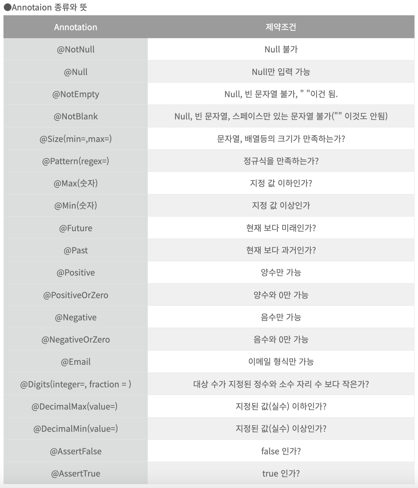
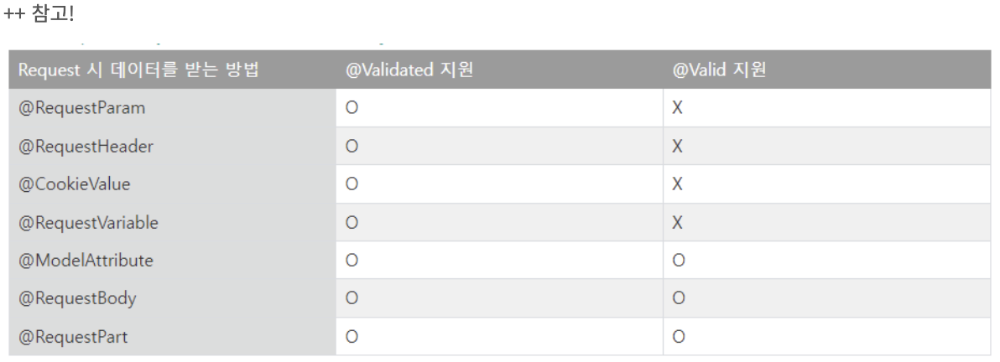

# Chapter 9. API & Swagger & Annotation

# 1. java의 Exception 종류들
1) NullPointerException
    - 객체 참조가 없는 상태, 즉 null값을 가지고 있는 변수를 참조할 때 발생!
    - 해당 객체가 Null인 상태에서 접근을 했을 때, 없는 상태기 때문에 발생하는 것임
```java
public class NullPointerExceptionExample {
	public static void main(String[] args) {
    	String data = null;
        System.out.println(data.toString());
    }
 }
```
> : String 타입의 data 변수에 null값을 세팅했는데, data.toString()으로 data값을 출력하려고했으므로 NullPointerException 발생
2) ArrayIndexOutOfBoundsException
    - 배열을 다룰 때 발생하는 예외
    - 할당된 배열의 인덱스 범위를 초과해서 사용할 때 발생함
```java
public class NullPointerExceptionExample {
	public static void main(String[] args) {
    	int[] arr = new int[3];
    	for (int i = 0; i <=3; i++) {
    		arr[i] = i;
    	}
    }
 }
```
> : 이 경우 arr은 인덱스 3까지 할당이 가능한데, for문을 보면 0,1,2,3까지 할당하므로 ArrayIndexOutOfBoundsException 발생
3) NumberFormatException
    - ParseXXX()와 같은 유형의 메서드를 통해 문자열을 숫자로 변환하는데, 매개변수로 오는 문자이 숫자로 변환될 수 없을 때 발생
```java
public class NumberFormatExceptionExample {
	public static void main(String[] args) {
    	String corretData = "100";  // 문자열 100은 숫자로 변환 할 수 있는 값이다.
    	String wrongData = "A100";  // 문자열 A100은 숫자로 변환 할 수 있는 값이다.

    	int value1 = Integer.parseInt(corretData);
    	int value2 = Integer.parseInt(wrongData);

    	System.out.println(value1);
    	System.out.println(value2);
    }
 }
```
> : 변수 correctData는 Integer로 변환할 수 있지만, wrongData는 Integer로 변환할 수 없으므로 NumberFormatException 발생
4) ClassCastException
    - 타입 변환(Casting)은 상위 클래스 <-> 하위 클래스, 구현 클래스 <-> 인터페이스 간에 가능!
    - 하지만 이러한 관계가 아니면 클래스는 다른 클래스로 변환 불가능!
```java
public class ClassCastExceptionExample {
	static class Animal {}
	static class Dog extends Animal{}
	static class Cat extends Animal{}


	public static void main(String[] args) {
		// Dog 객체 생성
    	Dog dog = new Dog();
    	changeDog(dog);

    	// Cat 객체 생성
    	Cat cat = new Cat();
    	changeDog(cat); 
    }
	public static void changeDog(Animal animal) {
		Dog dog = (Dog) animal; // ClassCastException 발생 가능
	}
}
```
> : changeDog 메서드에서 매개변수로 Dog 객체를 넣으면 타입 변환을 통해 할당 가능하지만, Cat 객체를 넣으면 ClassCastException이 발생
# 2. @Valid
> 개발을 진행할 때, validation 체크는 매우 중요하다
> 가령 클라이언트에서 데이터가 제대로 들어왔는지, DB에 데이터가 들어가기 전에 제대로 된 데이터가 맞는지 확인한다던지 등 다양한 validation이 선행되어야 한다.
> 이 때 @Valid 어노테이션을 통해 검증 과정을 거칠 수 있다.
### 2.1. 의존성 추가
- Gradle
```
implementation 'org.springframework.boot:spring-boot-starter-validation'
```
- Maven
```
<dependency>
    <groupId>org.springframework.boot</groupId>
    <artifactId>spring-boot-starter-validation</artifactId>
</dependency>
```

### 2.2. 사용법
- 검증할 객체 DTO에 검증할 어노테이션을 붙여준다.
- Controller의 DTO옆에 @Valid를 붙여준다(@Valid는 Dispatcher Servlet에서 @Valid 어노테이션을 찾아 검증을 진행하는 동작 원리 때문에 Controller단에서만 사용 가능하다).

1) 주문 요청을 표현하는 DTO - OrderRequest 클래스

```java
@Getter
@Setter
@ToString
@AllArgsConstructor
@NoArgsConstructor
public class OrderRequest {

    private Long menuSeq;

    @Pattern(regexp = "^[1-8]*$", message = "1부터 8까지의 정수만 입력 가능합니다.")
    private String orderTemp;

    @Pattern(regexp = "^[1-8]*$", message = "1부터 8까지의 정수만 입력 가능합니다.")
    private String orderMilk;

    @Pattern(regexp = "^[1-8]*$", message = "1부터 8까지의 정수만 입력 가능합니다.")
    private String orderShot;

    @Pattern(regexp = "^[0-9]*$", message = "정수만 가능")
    @Size(min = 10, max = 11, message = "전화번호 길이에 부합해야함.")
    private String phoneNum;
}
```

- @Pattern(regexp = "^[1-8]*$", message = "1부터 8까지의 정수만 입력 가능합니다.")
    - orderTemp, orderMilk, orderShot 필드에 적용됨
    - 입력값이 1부터 8까지의 정수만 포함되어야 함
    - 유효하지 않을 경우 "1부터 8까지의 정수만 입력 가능합니다." 메시지가 제공됨

- @Pattern(regexp = "^[0-9]*$", message = "정수만 가능")
    - phoneNum 필드에 적용됨
    - 입력값이 정수만 포함되어야 함
    - 유효하지 않을 경우 "정수만 가능" 메시지가 제공됨

- @Size(min = 10, max = 11, message = "전화번호 길이에 부합해야함.")
    - phoneNum 필드에 적용됨
    - 전화번호 길이가 10자에서 11자 사이여야 함
    - 유효하지 않을 경우 "전화번호 길이에 부합해야함." 메시지가 제공됨

2) DTO 유효성 검증을 위한 Controller

```java
   @PostMapping("")
   public Map doOrder(@RequestBody @Valid OrderRequestDto order, Errors errors)  {
   return errors.hasErrors() ? orderService.handleValidate(errors) : orderService.doOrder(order);
   }
```

- @RequestBody @Valid OrderRequestDto order:
    - 클라이언트에서 전송한 JSON 데이터를 OrderRequestDto 객체로 변환하고, @Valid 어노테이션을 사용하여 유효성을 검증

- Errors errors:
    - 유효성 검사 결과를 담는 객체. Errors 객체는 유효성 검증 과정에서 발생한 오류 정보를 포함함

- errors.hasErrors():
    - 유효성 검사에서 오류가 발생했는지 확인. 오류가 발생했다면 orderService.handleValidate(errors) 메소드를 호출하여 오류를 처리
    - 오류가 발생하지 않았다면 orderService.doOrder(order) 메소드를 호출하여 주문을 처리

3) 유효성 검사에 대한 오류 처리를 하는 Service
```java
@Override
public Map handleValidate(Errors errors) {
    Map<String, String> validResult = new HashMap<>();

    errors.getFieldErrors().forEach(er -> {
        validResult.put(er.getField(), er.getDefaultMessage());
    });

    return validResult;
}
```
- errors.getFieldErrors():
    - 필드 유효성 검사 오류 목록을 가져옴.

- validResult.put(er.getField(), er.getDefaultMessage()):
    - 각 필드 오류에 대해 필드 이름과 오류 메시지를 맵에 저장.

- return validResult:
    - 오류 메시지를 담은 맵을 반환. 이 맵은 클라이언트에 반환되어 어떤 필드에 어떤 오류가 발생했는지 알려준다.

### 2.3. @Valid 어노테이션 종류






