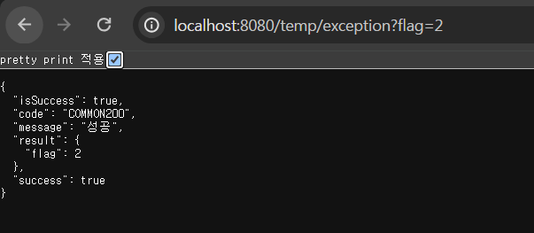
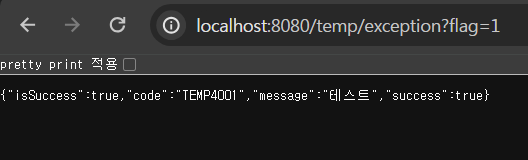

## 8주차 미션 인증

1. RestControllerAdvice의 장점
    - @ControllerAdvice의 역할인 예외 처리를 수행해주기 때문에 컨트롤러에서 따로 예외처리를 할 필요가 없다.
    - @ExceptionHandler를 사용하여 특정 예외에 대한 핸들러 메서드(에러 코드+에러메시지 등)를 정의할 수 있다.
    - 여러 클래스에서 발생하는 예외를 하나의 예외 처리 로직으로 해결할 수 있다. @RestControllerAdvice가 선언된 클래스는 모든 컨트롤러에 적용되기 때문.
2. RestControllerAdvice가 없으면 불편한 점
    - 예외처리 로직이 여러 클래스에 반복적으로 들어갈 수 있다.

- 미션 목록 조회 API 명세서는 6주차에 작성 완료

Notion: https://www.notion.so/makeus-challenge/Chapter-8-API-eff00a2782664a998d8a1ffe190a5f64#c34d69fe5fb04dd58d827ca36500ee5b

Github: https://github.com/qzzloz/SSUMC6th-spring-practice/tree/mission8
