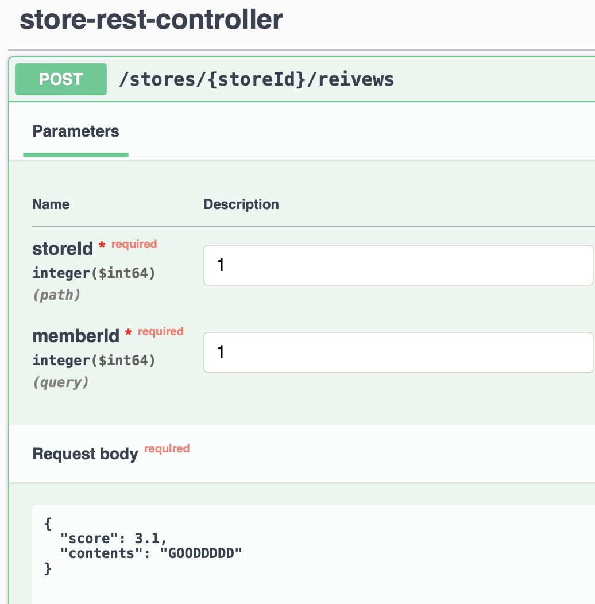
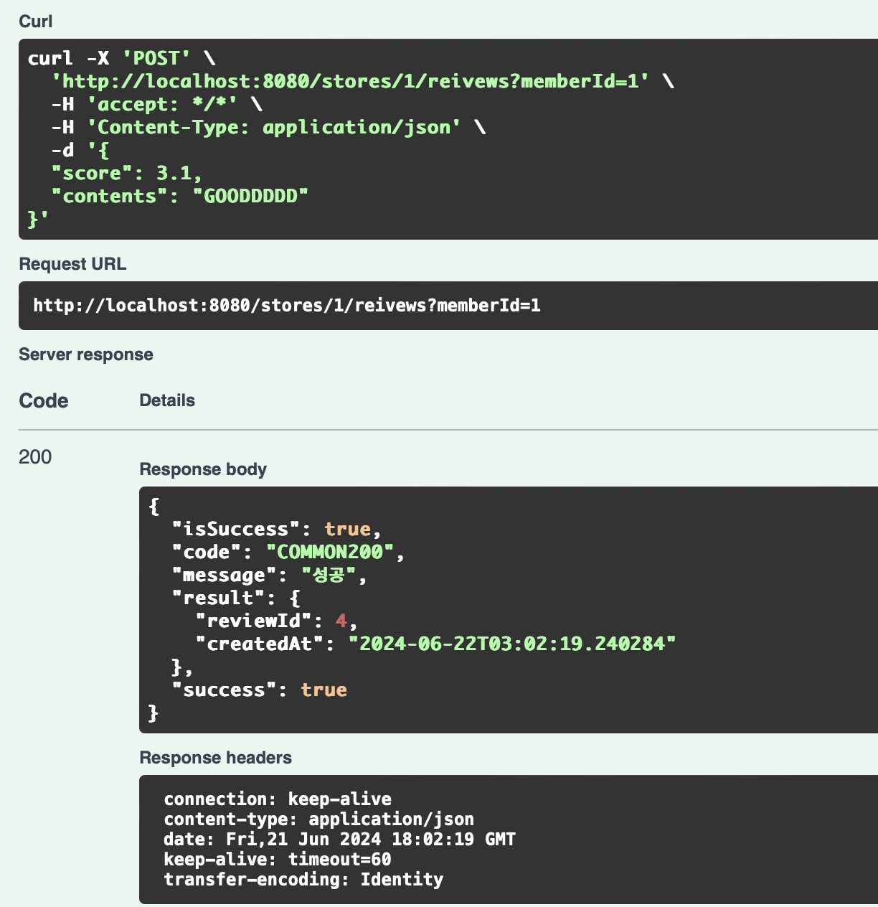
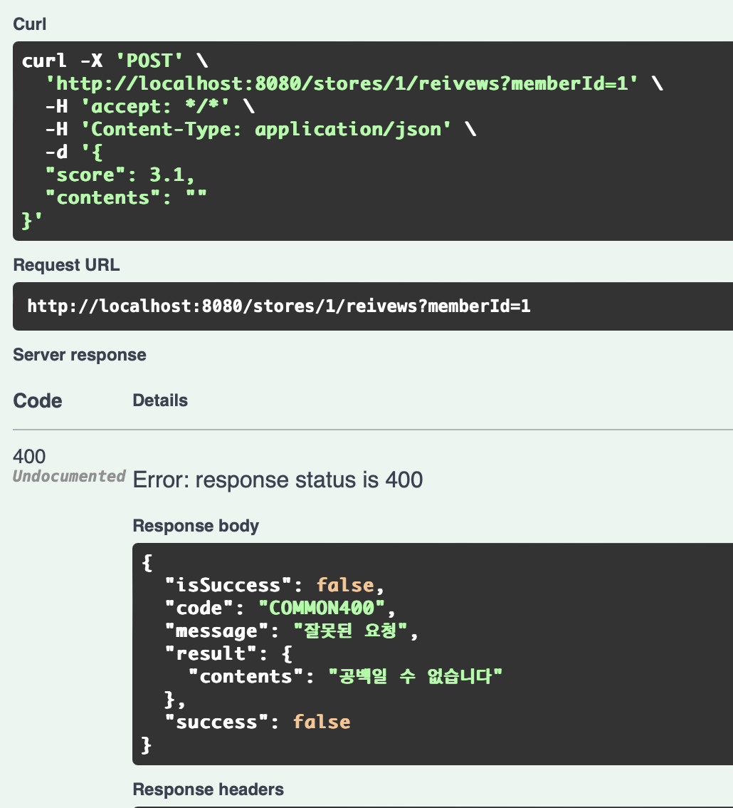
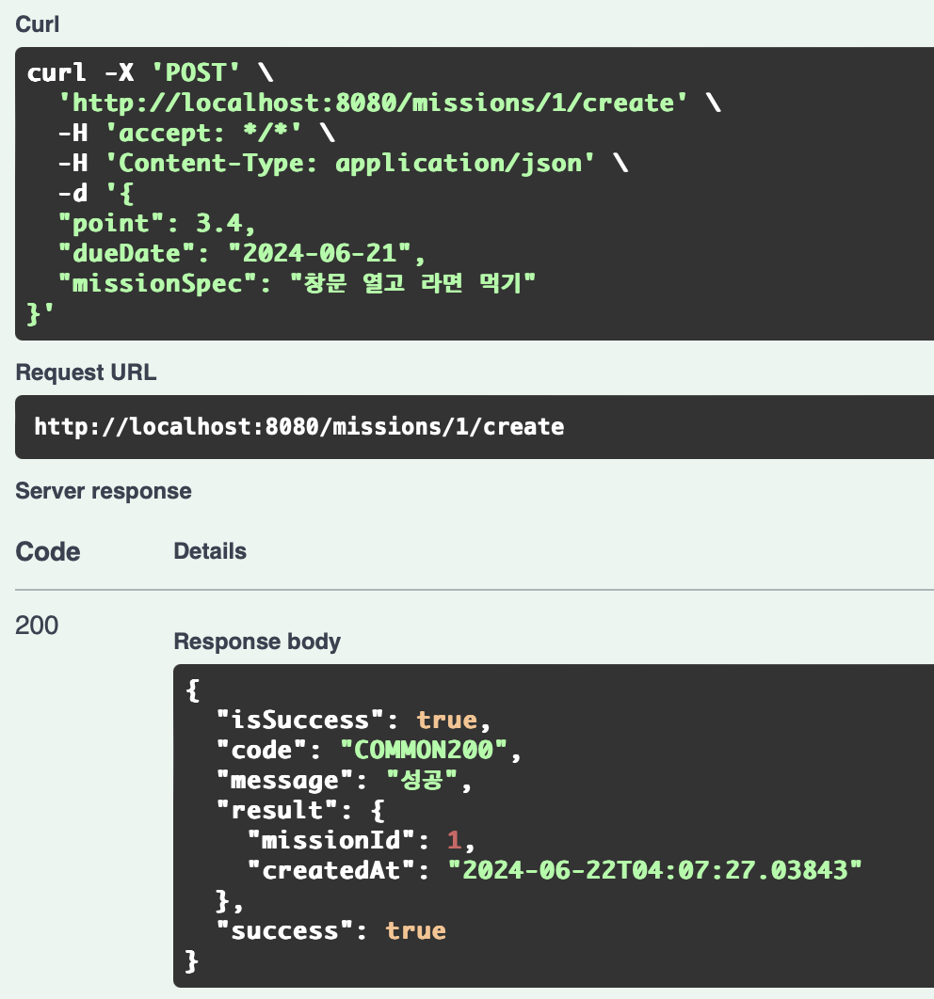
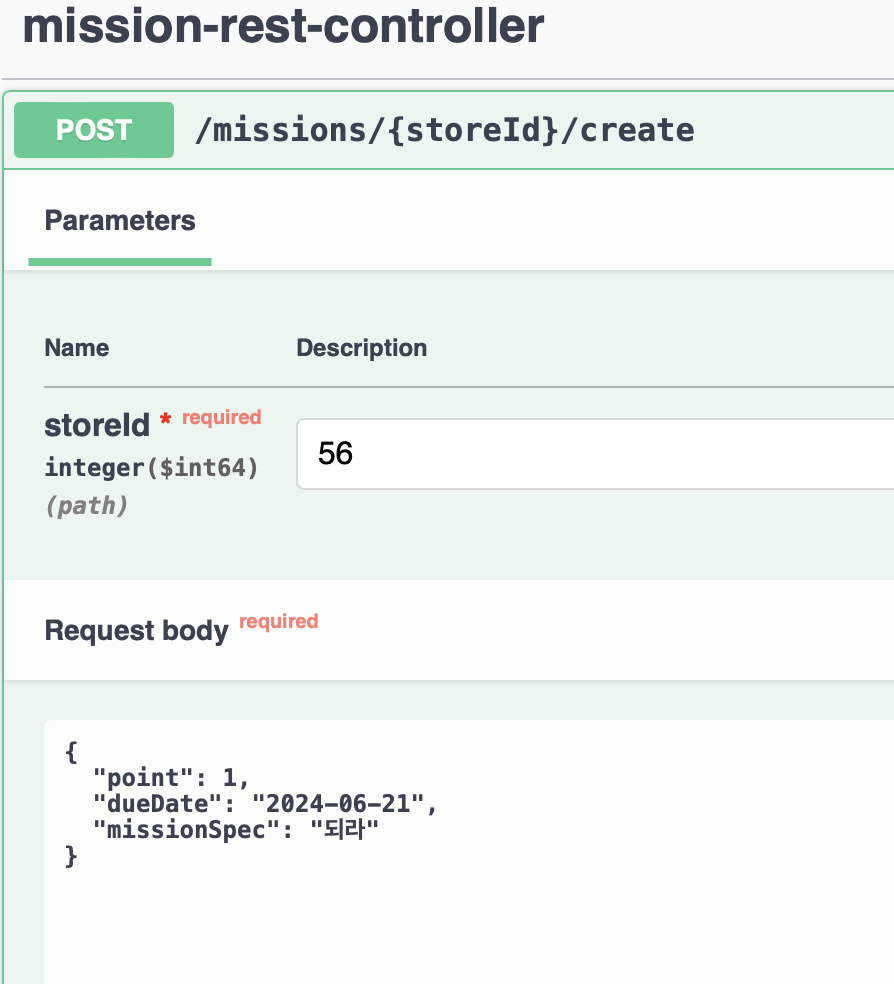
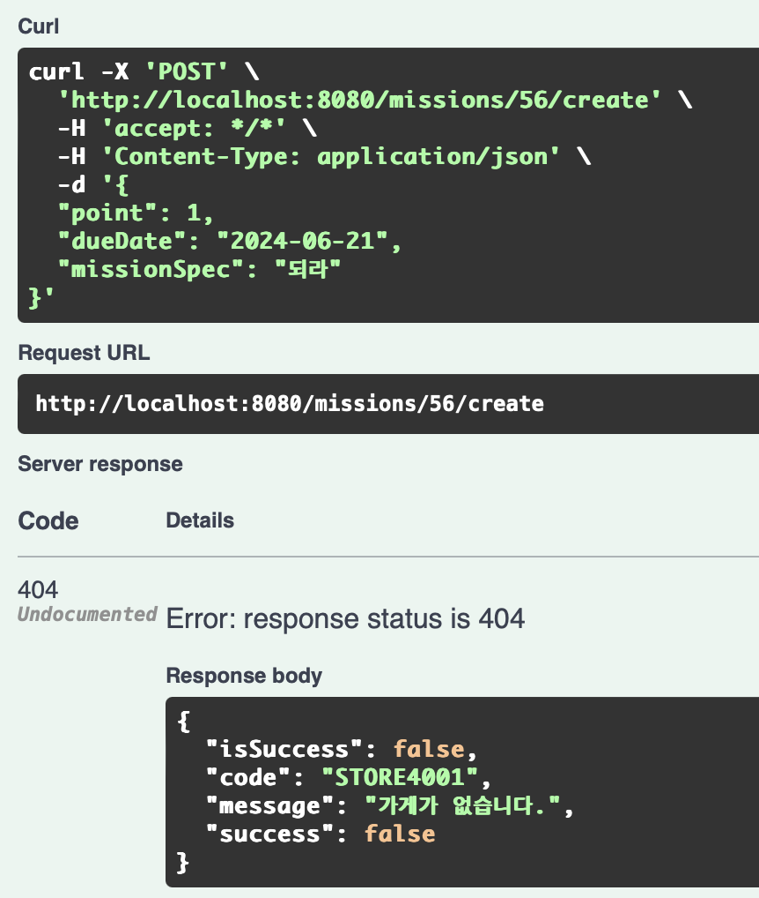
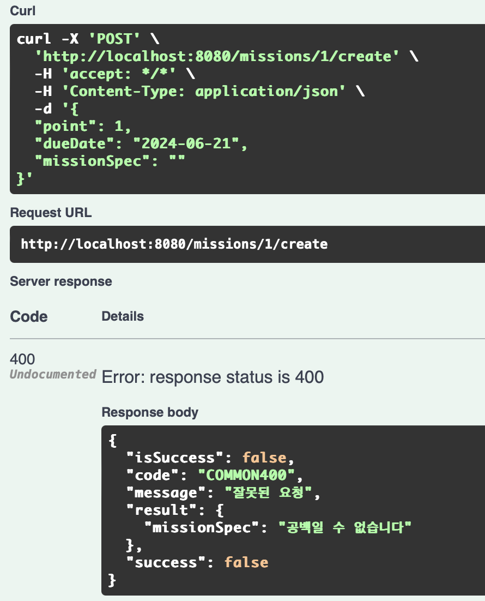
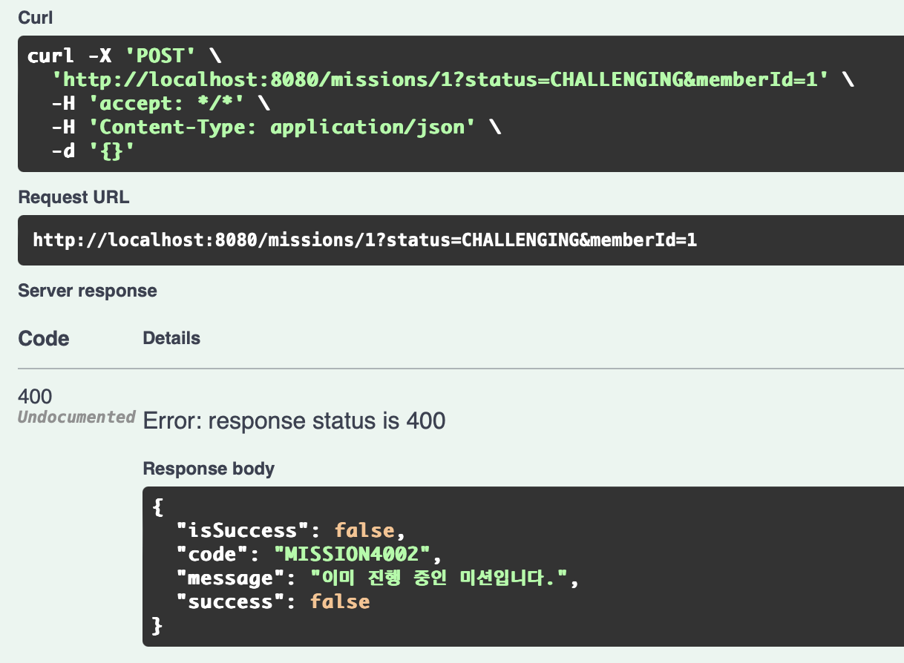

## 9주차 미션 인증

Github: https://github.com/qzzloz/SSUMC6th-spring-practice/tree/mission9

1-1. 2번 가게에 리뷰 추가하기 API 구현

1-2. 리뷰를 공란으로 두는 경부 검증 

2-1. 가게에 미션 추가하기 API 구현

2-2. 존재하지 않은 가게에 미션을 추가하는 경우 검증 

2-3. 미션 설명란을 공백으로 두는 경우 검증 

3-1. 가게의 미션을 도전 중인 미션에 추가(미션 도전하기) API 구현 

3-2. 이미 도전 중인 미션에 접근한 경우 

